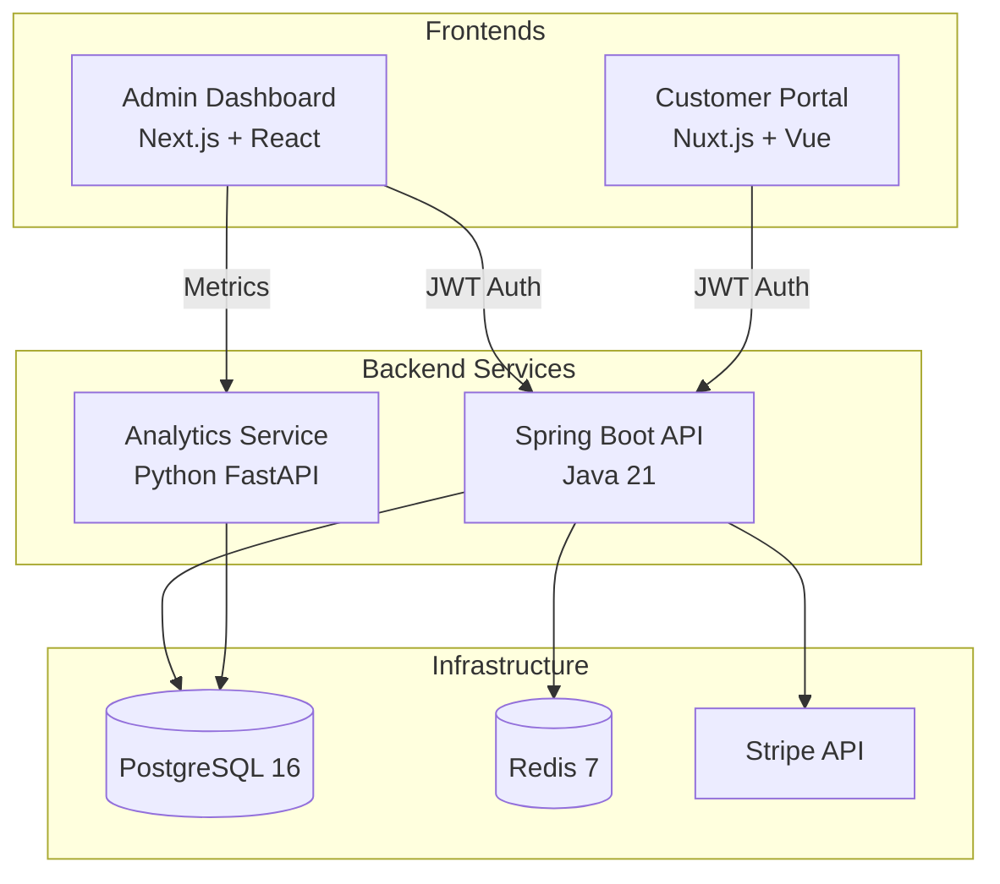
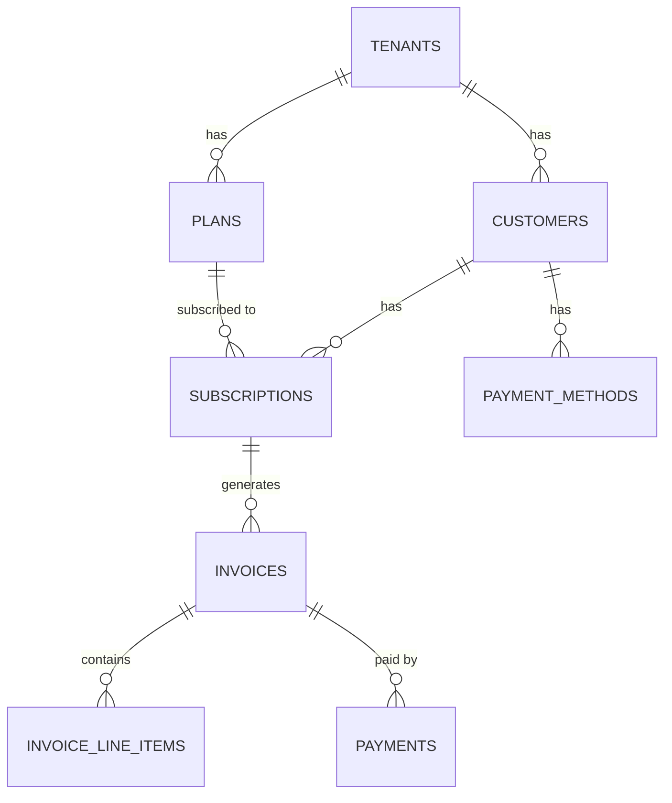

# SubscriptIO

A multi-tenant SaaS billing engine. I built this to handle the full subscription lifecycle — plans, trials, billing cycles, invoicing, payments — with real Stripe integration and a clean hexagonal architecture.

The backend runs on Java 21 with Spring Boot. There are two separate frontends: a Next.js admin dashboard for platform operators and a Nuxt.js customer portal for end users. A Python FastAPI microservice handles revenue analytics. Everything is containerized with Docker and has Terraform + Kubernetes manifests for AWS deployment.

## Architecture



## What it does

**For platform admins** (Next.js dashboard on port 3000):
- View MRR, active subscriptions, churn, and revenue-by-plan charts
- Manage tenants, pricing plans, and customers
- Browse subscriptions with status filters (active, trialing, past due, cancelled)
- View invoices and retry failed payments

**For customers** (Nuxt.js portal on port 3001):
- See current subscription, plan details, and billing period
- Browse available plans for upgrades/downgrades
- View invoice history with line-item detail modals
- Manage payment methods
- Cancel subscription with confirmation dialog

**Billing engine** runs as a daily scheduled job. It finds subscriptions that hit the end of their billing period, generates invoices with line items, and triggers payment collection through Stripe. Trials automatically convert to paid subscriptions when they expire.

**Subscription state machine** enforces valid transitions in the domain layer:
```
trialing → active      (trial ends, payment succeeds)
trialing → cancelled   (customer cancels during trial)
active   → past_due    (payment fails)
active   → cancelled   (customer cancels)
past_due → active      (retry succeeds)
past_due → cancelled   (max retries or customer cancels)
cancelled → expired    (grace period ends)
```

## Tech Stack

| Layer | Technology |
|---|---|
| Backend | Java 21, Spring Boot 3.3, Hibernate, Spring Security |
| Admin Dashboard | Next.js 15, React 19, TypeScript, Tailwind CSS, recharts |
| Customer Portal | Nuxt 3, Vue 3, TypeScript, Tailwind CSS |
| Analytics | Python, FastAPI, SQLAlchemy (async), numpy |
| Database | PostgreSQL 16, Flyway migrations |
| Payments | Stripe (Checkout Sessions, webhooks, SetupIntents) |
| Infrastructure | Docker, Terraform (AWS), Kubernetes, GitHub Actions |
| Cache | Redis 7 |

## Project Structure

```
subscriptio/
├── backend/                    Java 21 + Spring Boot (hexagonal architecture)
│   ├── domain/                 Entities, value objects, repository ports, state machine
│   ├── application/            Services, billing engine, webhook handler
│   ├── infrastructure/         JPA adapters, Stripe adapter, JWT security
│   └── api/                    REST controllers + DTOs (Java records)
├── admin-dashboard/            Next.js 15 admin UI
├── customer-portal/            Nuxt 3 customer-facing portal
├── analytics-service/          Python FastAPI revenue analytics
├── infra/
│   ├── docker-compose.yml      Local dev (PostgreSQL, Redis, Mailhog)
│   ├── docker/                 Multi-stage Dockerfiles (4 services)
│   ├── terraform/              AWS modules (VPC, RDS, ECS, ECR, ElastiCache)
│   └── k8s/                    Kubernetes manifests with RBAC, NetworkPolicies
├── docs/
│   ├── adr/                    Architecture Decision Records
│   └── diagrams/               Mermaid diagrams
├── dev-start.sh                Start everything locally
├── dev-stop.sh                 Stop everything
└── dev-logs.sh                 Tail service logs
```

## Quick Start

**Prerequisites:** Java 21, Maven, Node.js 20, Python 3.9+, Docker Desktop

```bash
# Clone and start
git clone https://github.com/vijay-prabhu/subscriptio.git
cd subscriptio

# Start all services (PostgreSQL, Redis, backend, both frontends)
./dev-start.sh

# Stop everything
./dev-stop.sh

# Tail logs for a specific service
./dev-logs.sh backend
./dev-logs.sh admin
./dev-logs.sh portal
./dev-logs.sh analytics
```

**Manual startup:**
```bash
# 1. Infrastructure
cd infra && docker compose up -d

# 2. Backend (port 8080)
cd backend && mvn spring-boot:run

# 3. Admin Dashboard (port 3000)
cd admin-dashboard && npm install && npm run dev

# 4. Customer Portal (port 3001)
cd customer-portal && npm install && npx nuxi@3.14.0 dev --port 3001

# 5. Analytics Service (port 8081)
cd analytics-service
python3 -m venv .venv && source .venv/bin/activate
pip install fastapi uvicorn[standard] sqlalchemy[asyncio] asyncpg pydantic pydantic-settings numpy
uvicorn app.main:app --port 8081
```

**Demo logins:**
- Admin Dashboard: `admin@demo.com` / `demo` → http://localhost:3000
- Customer Portal: `alice@example.com` / `demo` → http://localhost:3001

## API Endpoints

### Auth
```
POST /api/v1/auth/login          → JWT token
```

### Admin API
```
GET/POST   /api/v1/admin/tenants          → Tenant CRUD
GET/POST   /api/v1/admin/plans            → Plan CRUD
GET/POST   /api/v1/admin/customers        → Customer CRUD
GET        /api/v1/admin/subscriptions    → List with status filter
GET        /api/v1/admin/invoices         → List with status filter
GET        /api/v1/admin/metrics/dashboard → MRR, churn, plan breakdown
```

### Customer API
```
POST /api/v1/subscription/checkout    → Create subscription
POST /api/v1/subscription/{id}/cancel → Cancel at period end
POST /api/v1/subscription/{id}/change → Change plan
GET  /api/v1/invoices                 → Invoice history
```

### Webhook
```
POST /api/v1/webhooks/stripe          → Idempotent Stripe event handler
```

### Analytics
```
GET /metrics/mrr?tenant_id=1          → MRR with monthly trend
GET /metrics/churn?tenant_id=1        → Churn rate with trend
GET /analytics/cohort?tenant_id=1     → Cohort retention matrix
GET /analytics/forecast?tenant_id=1   → 3-month revenue projection
```

## Data Model

10 tables with Flyway migrations. Key design choices:
- `BIGINT GENERATED ALWAYS AS IDENTITY` for internal PKs, `UUID` for external API exposure
- `TIMESTAMPTZ` everywhere (never `timestamp`), `NUMERIC(12,2)` for money
- Manual FK indexes (PostgreSQL doesn't create these automatically)
- Partial indexes for hot queries (`WHERE status = 'ACTIVE'`)
- `@Version` column on every entity for optimistic locking



## Architecture Decisions

I used hexagonal architecture for the backend. The domain layer has zero Spring imports — entities, value objects, repository interfaces, and the state machine all live in `domain/`. The `infrastructure/` layer has the JPA adapters, Stripe adapter, and JWT security. Controllers are thin and delegate everything to application services.

I chose a shared-schema multi-tenancy approach with `tenant_id` on every table. Simpler than schema-per-tenant for a portfolio project but still shows the pattern. Every query includes the tenant filter.

The billing engine is a `@Scheduled` daily cron job. It finds subscriptions past their period end, generates invoices, and advances billing periods. I chose this over Quartz because it's simpler and testable — the billing logic is a regular service method that the scheduler calls.

Stripe webhooks are idempotent. Every event gets logged to a `webhook_events` table before processing. If the same event ID arrives twice, the second one returns 200 immediately without reprocessing.

Full ADRs are in [`docs/adr/`](docs/adr/).

## What I'd Add for Production

This is a portfolio project. Here's what I'd build before shipping it to real users.

**Auth and user management.** Right now auth is a hardcoded demo login. I'd add a `users` table with bcrypt passwords, email verification, password reset flows, and role-based access (admin vs customer). The JWT claims would carry the actual user ID and tenant ID instead of hardcoded values.

**Real Stripe integration.** The Stripe adapter structure is in place but uses test mode placeholders. I'd wire up actual Stripe Checkout Sessions for subscription creation, SetupIntents for saving payment methods, and process the webhook events fully — updating invoice status on `invoice.paid`, marking subscriptions as `past_due` on `invoice.payment_failed`, syncing plan changes from Stripe.

**Retry logic for failed payments.** When a payment fails, the billing engine should retry with exponential backoff (day 1, day 3, day 7) before marking the subscription as cancelled. Stripe handles some of this with Smart Retries, but the app needs to track the dunning state.

**Multi-tenant data isolation.** I'd add a Hibernate `@Filter` on all tenant-scoped entities that's enabled by default in the session. Right now tenant isolation is enforced at the service layer — a filter at the JPA level is a safety net against accidental cross-tenant data access.

**Rate limiting and API keys.** Add rate limiting per tenant (e.g., 100 req/s using Redis) and API key authentication for machine-to-machine access. The current JWT-only approach works for dashboards but not for programmatic API usage.

**Invoice PDF generation.** The `pdf_url` field exists on invoices but nothing generates the PDF yet. I'd use OpenPDF or iText to render invoices and store them in S3 with pre-signed URLs.

**Email notifications.** Send emails on key events: subscription created, payment succeeded, payment failed, subscription cancelled. The Mailhog container is already in Docker Compose for testing this.

**Observability.** Add structured logging with correlation IDs, Prometheus metrics from Spring Actuator, and distributed tracing. The Kubernetes manifests have resource limits and health probes, but I'd add a Grafana dashboard for MRR trends and error rates.

**Database read replica.** The analytics service currently reads from the primary database. In production, it should point to a read replica so analytics queries don't impact the billing engine.

**CI/CD deployment pipeline.** The PR check workflow runs tests. I'd add deployment pipelines that build Docker images, push to ECR, and update ECS services. The Terraform and K8s manifests are ready — they just need a `terraform apply` step.

## Tests

```bash
# Backend unit tests (20 tests, ~200ms)
cd backend && mvn test -Dtest="SubscriptionStateMachineTest,MoneyTest"

# Analytics service tests (9 tests)
cd analytics-service && source .venv/bin/activate && python -m pytest tests/ -v

# Admin dashboard build check
cd admin-dashboard && npm run build

# Customer portal build check
cd customer-portal && npx nuxi@3.14.0 build
```

## License

MIT
