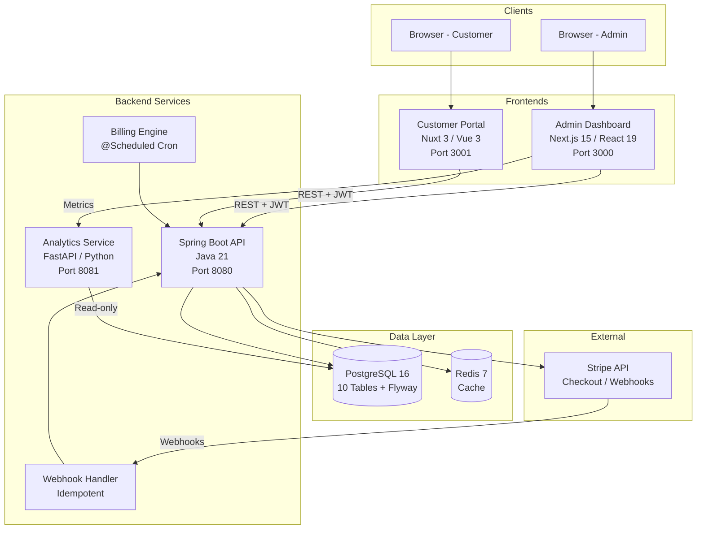

# System Architecture

```mermaid
graph TB
    subgraph "Clients"
        BR1[Browser - Admin]
        BR2[Browser - Customer]
    end

    subgraph "Frontends"
        AD[Admin Dashboard<br/>Next.js 15 / React 19<br/>Port 3000]
        CP[Customer Portal<br/>Nuxt 3 / Vue 3<br/>Port 3001]
    end

    subgraph "Backend Services"
        API[Spring Boot API<br/>Java 21<br/>Port 8080]
        BIL[Billing Engine<br/>@Scheduled Cron]
        WH[Webhook Handler<br/>Idempotent]
        AN[Analytics Service<br/>FastAPI / Python<br/>Port 8081]
    end

    subgraph "Data Layer"
        PG[(PostgreSQL 16<br/>10 Tables + Flyway)]
        RD[(Redis 7<br/>Cache)]
    end

    subgraph "External"
        ST[Stripe API<br/>Checkout / Webhooks]
    end

    BR1 --> AD
    BR2 --> CP
    AD -->|REST + JWT| API
    CP -->|REST + JWT| API
    AD -->|Metrics| AN
    API --> PG
    API --> RD
    API --> ST
    ST -->|Webhooks| WH
    WH --> API
    BIL --> API
    AN -->|Read-only| PG
```
