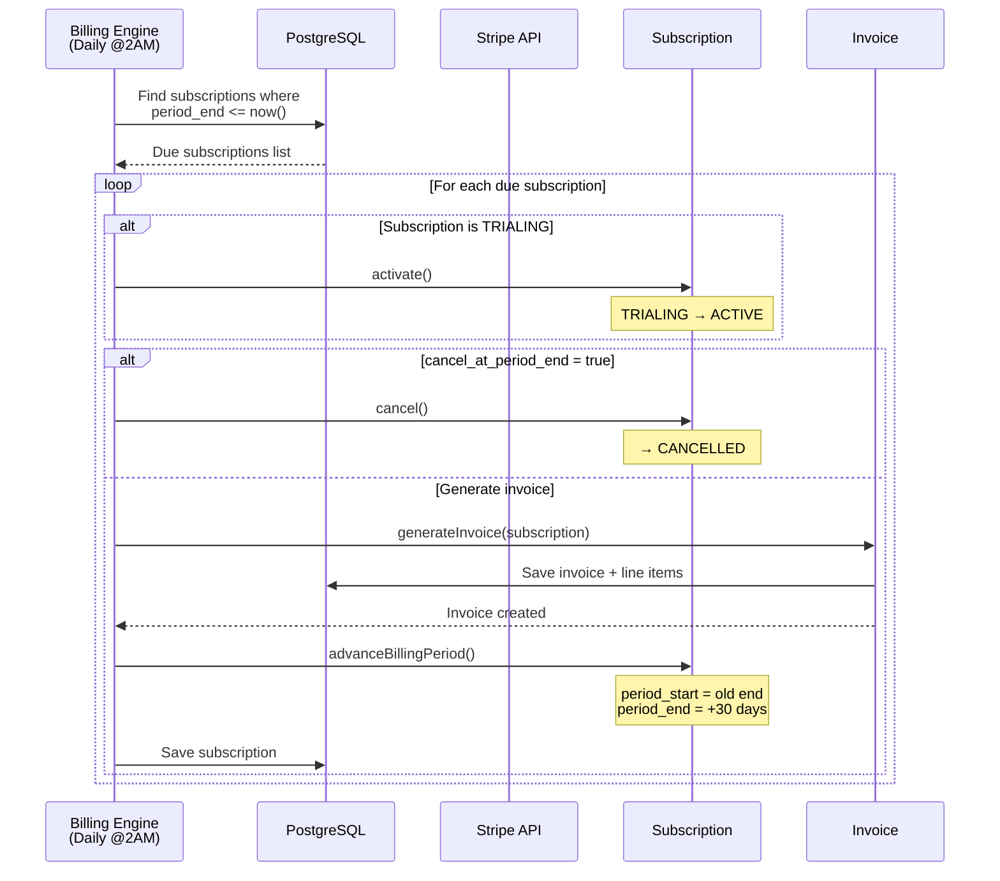
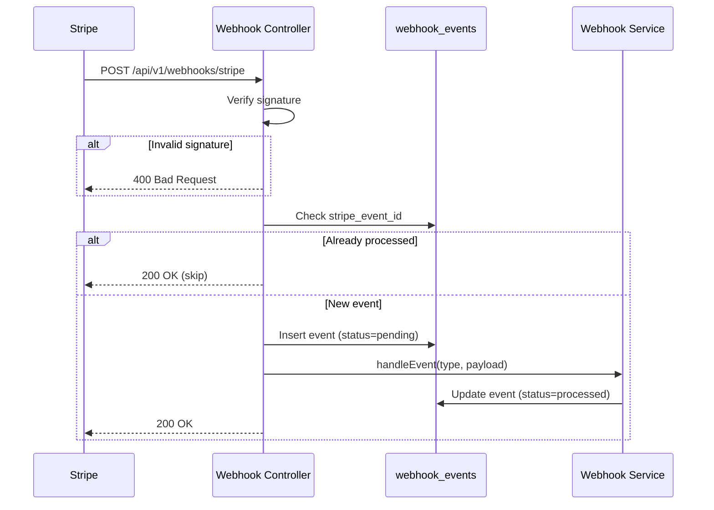

# Billing Flow

```mermaid
sequenceDiagram
    participant Cron as Billing Engine<br/>(Daily @2AM)
    participant DB as PostgreSQL
    participant Stripe as Stripe API
    participant Sub as Subscription
    participant Inv as Invoice

    Cron->>DB: Find subscriptions where<br/>period_end <= now()
    DB-->>Cron: Due subscriptions list

    loop For each due subscription
        alt Subscription is TRIALING
            Cron->>Sub: activate()
            Note over Sub: TRIALING → ACTIVE
        end

        alt cancel_at_period_end = true
            Cron->>Sub: cancel()
            Note over Sub: → CANCELLED
        else Generate invoice
            Cron->>Inv: generateInvoice(subscription)
            Inv->>DB: Save invoice + line items
            Inv-->>Cron: Invoice created

            Cron->>Sub: advanceBillingPeriod()
            Note over Sub: period_start = old end<br/>period_end = +30 days
            Cron->>DB: Save subscription
        end
    end
```

## Stripe Webhook Flow

```mermaid
sequenceDiagram
    participant Stripe
    participant WH as Webhook Controller
    participant DB as webhook_events
    participant Svc as Webhook Service

    Stripe->>WH: POST /api/v1/webhooks/stripe
    WH->>WH: Verify signature
    alt Invalid signature
        WH-->>Stripe: 400 Bad Request
    end

    WH->>DB: Check stripe_event_id
    alt Already processed
        WH-->>Stripe: 200 OK (skip)
    else New event
        WH->>DB: Insert event (status=pending)
        WH->>Svc: handleEvent(type, payload)
        Svc->>DB: Update event (status=processed)
        WH-->>Stripe: 200 OK
    end
```
