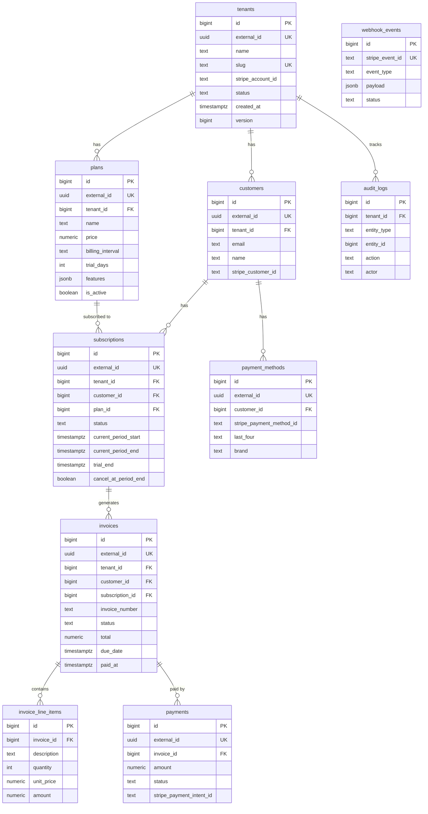

# Data Model

```mermaid
erDiagram
    tenants {
        bigint id PK
        uuid external_id UK
        text name
        text slug UK
        text stripe_account_id
        text status
        timestamptz created_at
        bigint version
    }

    plans {
        bigint id PK
        uuid external_id UK
        bigint tenant_id FK
        text name
        numeric price
        text billing_interval
        int trial_days
        jsonb features
        boolean is_active
    }

    customers {
        bigint id PK
        uuid external_id UK
        bigint tenant_id FK
        text email
        text name
        text stripe_customer_id
    }

    subscriptions {
        bigint id PK
        uuid external_id UK
        bigint tenant_id FK
        bigint customer_id FK
        bigint plan_id FK
        text status
        timestamptz current_period_start
        timestamptz current_period_end
        timestamptz trial_end
        boolean cancel_at_period_end
    }

    invoices {
        bigint id PK
        uuid external_id UK
        bigint tenant_id FK
        bigint customer_id FK
        bigint subscription_id FK
        text invoice_number
        text status
        numeric total
        timestamptz due_date
        timestamptz paid_at
    }

    invoice_line_items {
        bigint id PK
        bigint invoice_id FK
        text description
        int quantity
        numeric unit_price
        numeric amount
    }

    payment_methods {
        bigint id PK
        uuid external_id UK
        bigint customer_id FK
        text stripe_payment_method_id
        text last_four
        text brand
    }

    payments {
        bigint id PK
        uuid external_id UK
        bigint invoice_id FK
        numeric amount
        text status
        text stripe_payment_intent_id
    }

    webhook_events {
        bigint id PK
        text stripe_event_id UK
        text event_type
        jsonb payload
        text status
    }

    audit_logs {
        bigint id PK
        bigint tenant_id FK
        text entity_type
        bigint entity_id
        text action
        text actor
    }

    tenants ||--o{ plans : has
    tenants ||--o{ customers : has
    customers ||--o{ subscriptions : has
    plans ||--o{ subscriptions : "subscribed to"
    subscriptions ||--o{ invoices : generates
    invoices ||--o{ invoice_line_items : contains
    invoices ||--o{ payments : "paid by"
    customers ||--o{ payment_methods : has
    tenants ||--o{ audit_logs : tracks
```
