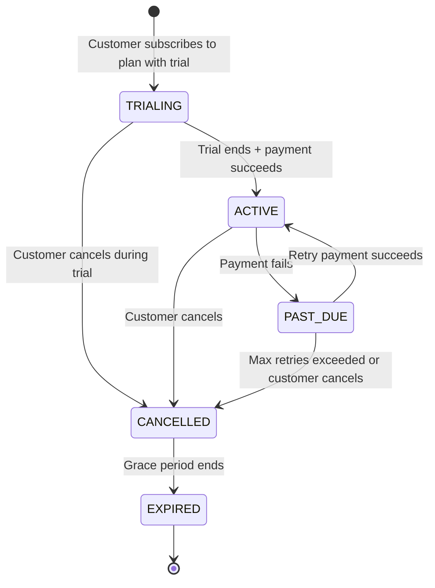
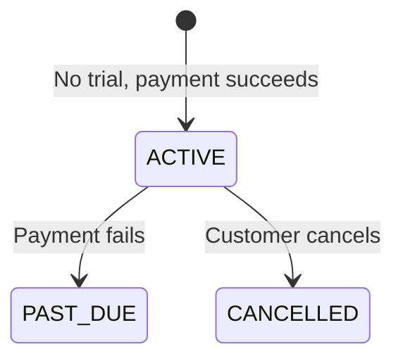

# Subscription State Machine

## Transition Rules

All transitions are enforced in `SubscriptionStateMachine.java` in the domain layer. Invalid transitions throw `IllegalStateException`. The entity methods (`activate()`, `cancel()`, `markPastDue()`, `expire()`) call the state machine before updating status.

## Direct-to-Active Flow

If a plan has `trial_days = 0`, the subscription skips `TRIALING` and starts as `ACTIVE` immediately.

